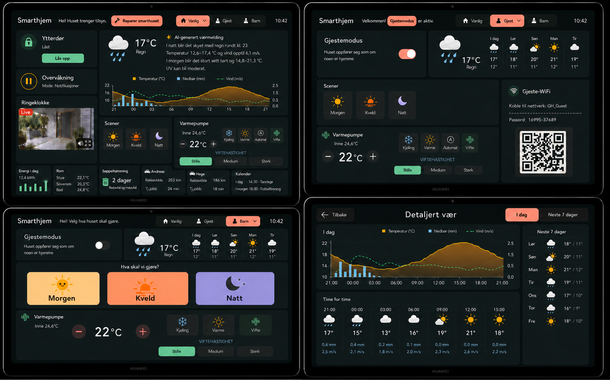

# Wall dashboard redesign — implementation brief

## Status and purpose

This document is the implementation contract for the next dashboard iteration. It records the approved visual direction and the required behavior so a later Codex session can implement it without repeating the design process.

Do not treat values rendered in the mockup as constants. Temperatures, weather, energy, room readings, waste dates, car ranges, travel times, calendar entries, access codes, and repair state must come from Home Assistant or a server-side integration. The image is authoritative for composition and styling; this document is authoritative for behavior, visibility rules, accessibility, and data ownership.

No implementation work described below has been performed yet.

## Visual source of truth

Primary approved concept:



Supporting references:

- [Current implemented dashboard](./assets/current-dashboard-baseline.png)
- [Temperature graph reference](./assets/weather-temperature-reference.png)
- [Precipitation graph reference](./assets/weather-precipitation-reference.png)
- [Wind graph reference](./assets/weather-wind-reference.png)

The primary image shows four landscape tablet states in this order:

1. upper-left: `Vanlig`
2. upper-right: `Gjest`
3. lower-left: `Barn`
4. lower-right: `Detaljert vær`

## Product boundary

- The product is currently only a permanently wall-mounted Huawei MatePad T-class tablet.
- Design for landscape `16:10`, with `1920 × 1200` as the target viewport.
- It is viewed from approximately one metre and touched at arm's length.
- Do not optimize the primary composition for phones or desktop monitors in this iteration.
- The application remains a React/TypeScript client and Node/Express server in one deployable service.
- Home Assistant credentials remain server-side. Never expose `HA_TOKEN` to the browser.
- The primary dashboard must fit without page scrolling at the target viewport.
- No card may overlap, merge into, obscure, or clip another card. Preserve a visible 8–12 px gap between cards.

## Existing codebase to extend

Work in the existing implementation rather than replacing the stack:

- `src/client/App.tsx`: current single-page dashboard and action state handling
- `src/client/styles.css`: current layout and visual tokens
- `src/client/api.ts`: same-origin API calls
- `src/client/dashboardModel.ts`: presentation helpers
- `src/shared/entities.ts`: entity IDs, state keys, action types, shared state shape
- `src/server/homeAssistant.ts`: fixed, allow-listed Home Assistant reads and actions
- `src/server/app.ts`: validated browser-facing endpoints
- `src/server/index.ts`: environment-variable wiring
- `src/client/*.test.tsx` and `src/server/*.test.ts`: established Vitest patterns

Retain the existing command-then-confirm behavior: after every Home Assistant action, read the affected entity again and render the confirmed state. Do not use optimistic success states.

## Visual system

The visual direction is inspired by the warm, minimal custom-card UX of the My Smart Home dashboard videos, but it must remain an original design for this house.

### Colors

Create CSS custom properties and use them consistently:

| Token | Value | Use |
| --- | --- | --- |
| `--bg` | `#141414` | page background |
| `--surface` | `#262522` | card background |
| `--surface-raised` | slightly lighter than `--surface` | selected/inset areas |
| `--text` | `#F4EFE7` | primary text |
| `--text-muted` | `#A9A19A` | secondary text |
| `--pink` | `#F2A6B8` | selected mode and repair action |
| `--mint` | `#7FE3B2` | safe, locked, enabled, selected fan speed |
| `--apricot` | `#F4B17B` | sun, heating, temperature graph |
| `--periwinkle` | `#A8B7F0` | night and cooling |
| `--violet` | `#9B65C7` | restrained atmospheric accent only |
| `--danger` | coral/red | live camera badge and real warnings only |

Avoid neon, glassmorphism, heavy gradients, glossy 3D effects, and borders around every minor element.

### Geometry and typography

- All top-level cards are rectangles with modest rounded corners; they may have unequal widths and heights.
- Do not use square top-level cards.
- Use Inter and Material Symbols, already present in the project.
- Target minimums at `1920 × 1200`: 18 px body, 24 px card title, 48–56 px touch targets.
- Selected controls must be identifiable by fill, border, and icon/check—not color alone.
- Use cream primary text and muted taupe secondary text with strong contrast.
- Keep content density high but calm; remove decorative or duplicated status summaries.
- Use `min-width: 0`, `min-height: 0`, explicit grid tracks, and internal overflow rules so card content cannot force overlap.

## Shared shell and mode navigation

All dashboard modes share the same fixed top bar:

- left: `Smarthjem`
- next: concise contextual status sentence
- centre/right: segmented mode selector `Vanlig / Gjest / Barn`
- far right: current time

Do not show outdoor temperature in the header; the weather card owns weather information.

The selected mode uses the blush-pink treatment plus an icon/check. The selector must be a real accessible tablist or equivalent set of buttons with clear current-state semantics.

### Dynamic repair action

`Reparer smarthuset` appears inline beside the header status sentence only when a configured problem state exists. It is absent when everything is healthy. It must not appear as a floating button or at the bottom of the dashboard.

Preserve the current accessible modal behavior and repair iframe (`http://192.168.1.127:8080/`), including focus transfer, Escape dismissal, visible close control, and focus restoration.

Add a server-configurable, allow-listed repair health source rather than evaluating arbitrary entities in the browser. Exact Home Assistant health entity IDs still need to be confirmed. A reasonable configuration shape is a comma-separated environment variable or an explicit typed list in server configuration. Document the chosen healthy/unhealthy state mapping in `.env.example` when implementing it.

## Information ownership and anti-duplication

Each fact appears once per screen:

- header: title, contextual sentence, mode selector, clock
- weather card: outdoor conditions, AI summary, graph, forecast data
- door card: lock state and lock action
- surveillance card: security mode only
- heat-pump card: indoor reading, target, HVAC mode, fan speed
- scenes card: `Morgen`, `Kveld`, `Natt`
- guest Wi-Fi card: network, voucher/passcode, QR code
- metric cards: only their named metric

Never add a summary card that repeats a detailed card. Do not repeat `17°C`, `24,6°C`, `22°C`, security state, guest network details, or scene actions on the same screen.

## Vanlig mode — exact target

Use a fixed tablet grid with three visual bands below the header. A practical implementation is a 12-column outer grid with nested grids inside the left stack and lower metric row. Tune exact track sizes against the saved reference image at `1920 × 1200`.

### Upper band

Left column, vertically stacked:

1. `Ytterdør`
   - state: `Låst` or unlocked equivalent
   - mint closed-lock icon when locked
   - action button: `Lås opp` when locked and `Lås` when unlocked
   - action calls the fixed service for the configured `lock.*` entity and then confirms state
2. `Overvåkning`
   - primary: `Overvåkning`
   - secondary derives from `input_number.toggle_security_mode`
   - mode `1`: `Mode: Armert`, `mdi:shield-check`, green/mint
   - mode `2`: `Mode: Notifikasjoner`, `mdi:pause-circle`, orange
   - mode `3`: `Mode: Deaktivert`, `mdi:shield-off`, red
   - fallback: `Mode: Ukjent`, help icon, grey
   - tap calls `script.toggle_security_mode_script`
   - no hold action

Right side: one weather card containing all of the following and no weekday tiles:

- top-left: current condition icon, current outdoor temperature, condition (`17°C`, `Regn` in the fixture)
- top-right: sparkle icon, `AI-generert værmelding`, and concise generated Norwegian copy
- bottom: combined current-day graph with an accessible legend:
  - apricot line/area: `Temperatur (°C)`
  - blue bars: `Nedbør (mm)`
  - mint dashed line: `Vind (m/s)`

Fixture copy shown in the approved image:

> I natt blir det skyet med regn rundt kl. 23. Temperatur 12,6–17,4 °C og vind opptil 6,1 m/s. I morgen blir det stort sett tørt og 14,8–21,3 °C. UV kan bli moderat.

Production copy must come from a configured Home Assistant sensor or a server-side weather summarization source. Do not call an AI service directly from the browser. Render a Norwegian unavailable state when the summary is missing.

Keep the weather icon, summary type, line spacing, and graph compact enough that the weather card leaves room for the middle row. It must remain readable and must not push the heat-pump card into the lower row.

### Middle band

Left to right:

1. `Ringeklokke`
   - live doorbell camera preview
   - small red `LIVE` badge
   - speaker/mute control
   - fullscreen control
   - use the configured Home Assistant `camera.*` stream through a secure server/proxy strategy; do not expose the HA token in the media URL
   - show a clear unavailable poster when the stream cannot load
2. `Scener`
   - exactly three controls: `Morgen`, `Kveld`, `Natt`
   - short horizontal rectangular buttons with the existing service mappings
   - morning is yellow/apricot, evening orange, night periwinkle
3. `Varmepumpe`
   - one complete rectangular card; its bottom border must be visible above the metric row
   - `Inne 24,6°C`
   - target `22°C` with minus/plus controls
   - modes: `Kjøling`, `Varme`, `Automat`, `Vifte`
   - compact `VIFTEHASTIGHET` group fully inside the card: `Stille`, `Medium`, `Sterk`
   - retain current confirmation, clamping, and fan-mode behavior unless live entity capabilities require a documented adjustment
   - compact icons and gaps before reducing accessible hit targets

### Lower metric band

One row of six fully visible rectangular cards. Unequal widths are expected; calendar may be wider. The row must never be covered by the heat-pump card.

1. `Energi i dag`
   - current daily consumption and small mint bar chart
   - fixture: `12,4 kWh`
2. `Rom`
   - compact room temperature list
   - fixture: `Stue 22,1°C`, `Soverom 20,3°C`, `Bad 24,8°C`
3. `Søppeltømming`
   - mint waste icon
   - countdown and waste types
   - fixture: `2 dager`, `Restavfall og matavfall`
4. `Andreas`
   - car icon
   - current range and travel time to work
   - fixture: `Rekkevidde 253 km`, `Til jobb 24 min`
5. `Hege`
   - car icon
   - current range and travel time to work
   - fixture: `Rekkevidde 186 km`, `Til jobb 18 min`
6. `Kalender`
   - the next two relevant household events
   - fixture: `I dag 14:30 · Tannlege`, `I morgen 18:00 · Fotballtrening`

Do not show guest Wi-Fi anywhere in Vanlig.

## Gjest mode — exact target

Keep a landscape tablet layout, not a phone layout.

- header sentence: `Velkommen! Gjestemodus er aktiv.`
- selected mode: `Gjest`
- one prominent `Gjestemodus` switch
- one weather overview with current condition and compact five-day strip as shown in the approved reference
- one scenes card containing `Morgen`, `Kveld`, `Natt`
- one simplified heat-pump card with current indoor temperature, target, modes, and fan speed
- exactly one `Gjeste-WiFi` card:
  - network `GH_Guest`
  - confirmed voucher/passcode
  - large QR code generated from the actual guest connection payload
- do not show owner energy, detailed rooms, cars, waste, calendar, repair tools, or admin alerts

The existing voucher creation action remains allowed only through the fixed server action and must render the confirmed new voucher.

## Barn mode — exact target

Keep a landscape tablet layout.

- header sentence: `Hei! Velg hva huset skal gjøre.`
- selected mode: `Barn`
- absolutely no Wi-Fi network name, password, QR code, energy price, repair action, warnings, cars, calendar, or admin data
- one `Gjestemodus` switch with the explanation `Huset oppfører seg som om noen er hjemme`
- one simple weather card with current condition and compact forecast strip
- very large, friendly `Morgen`, `Kveld`, and `Natt` actions
- one safe, simplified heat-pump card with indoor temperature, bounded target controls, mode choices, and fan speed

## Detaljert vær — exact target

This is a dedicated weather view reached from the weather card. It is not another dashboard mode in the main segmented selector.

Header:

- `Tilbake`
- title `Detaljert vær`
- tabs `I dag` and `Neste 7 dager`

Content:

- one large combined graph using the same temperature, precipitation, and wind encodings as Vanlig
- hourly strip with icon, temperature, precipitation, and wind values
- right-side seven-day list
- accessible legend uses words/icons plus color
- no duplicated current-weather summary cards

Implement charts as responsive SVG or a lightweight chart component with deterministic dimensions. Do not use the reference PNGs as production chart images.

## Data and integration plan

### Known mappings already in the repository

| Purpose | Current entity/action |
| --- | --- |
| Gjestemodus | `input_boolean.gjest` |
| Guest voucher | `sensor.67647a4bca314858fac0f8fc_voucher` |
| Create voucher | `button.67647a4bca314858fac0f8fc_create` |
| Morgen | `automation.modus_god_morgen` |
| Kveld | `script.1572988362234` |
| Natt | `script.1569099501074` |
| Climate | `climate.stue` |
| Cooling automation | `automation.klima_automatisk_kjoling_optimalisert` |
| Outdoor temperature | `sensor.indoor_ute_temperature` |
| House mode | configurable, default `input_select.home_mode` |

### Explicitly specified new mapping

| Purpose | Entity/action |
| --- | --- |
| Security mode | `input_number.toggle_security_mode` |
| Cycle security mode | `script.toggle_security_mode_script` |
| Exterior-door lock | `lock.aqara_smart_lock_u200_2` |
| Hourly weather forecast | `sensor.weather_hourly` |
| Daily weather forecast | `sensor.weather_daily` |

The hourly weather entity exposes a `forecast` attribute used by the approved charts. Each forecast entry may contain `datetime`, `temperature`, `precipitation_probability`, `precipitation`, `wind_speed`, `wind_gust_speed`, and `cloud_coverage`. Treat individual missing attributes as unavailable series data instead of failing the whole weather card.

The daily weather entity exposes current weather attributes plus a `forecast` array. The supplied example includes `condition`, `precipitation_probability`, `datetime`, `wind_bearing`, `uv_index`, `temperature`, `templow`, `wind_gust_speed`, `wind_speed`, `precipitation`, and `humidity`. Units must come from the entity attributes where supplied; do not hard-code the example readings.

### Entity IDs that must be discovered or configured before implementation

- Ring doorbell `camera.*` and any speaker/mute service
- AI weather-summary sensor/source
- daily energy sensor and history source for bars
- room temperature sensors for Stue, Soverom, and Bad
- waste collection entities
- Andreas car range sensor
- Hege car range sensor
- travel-time sensors to each workplace
- household calendar entity/entities
- repair-problem/health entities

Do not guess these IDs in production code. Add typed environment overrides in `.env.example`, resolve them in `src/server/index.ts`, and keep defaults only where a real current default already exists.

### Shared state model

Extend `DashboardStateKey`, `DashboardEntityIds`, and `DashboardAction` in `src/shared/entities.ts`. Prefer meaningful keys such as:

```ts
securityMode
frontDoorLock
doorbellCamera
weather
weatherSummary
energyToday
roomLiving
roomBedroom
roomBathroom
waste
carAndreasRange
carHegeRange
andreasTravelTime
hegeTravelTime
calendar
repairHealth
```

Use typed view models for compound data such as forecasts, waste, cars, and calendar rather than spreading raw `attributes` access throughout JSX.

### Server API

Keep the browser-facing API narrow and validated. Either extend the existing `/api/states` response or introduce a single typed `/api/dashboard` read model. Do not allow arbitrary entity IDs or service names from browser input.

New fixed actions should include only what the UI needs:

- cycle security mode
- lock door
- unlock door
- existing scenes
- guest toggle and voucher generation
- heat-pump mode, fan speed, and target temperature

Return freshly confirmed state after each command. Treat camera streaming separately from JSON state data and proxy it safely if required.

## Component structure

Refactor the current monolithic `App.tsx` into focused components while preserving the established state/action behavior. Suggested structure:

```text
src/client/
  App.tsx
  components/
    DashboardHeader.tsx
    ModeSelector.tsx
    DoorLockCard.tsx
    SecurityCard.tsx
    WeatherCard.tsx
    WeatherChart.tsx
    DoorbellCard.tsx
    ScenesCard.tsx
    HeatPumpCard.tsx
    MetricCard.tsx
    CalendarCard.tsx
    GuestWifiCard.tsx
  modes/
    RegularDashboard.tsx
    GuestDashboard.tsx
    ChildDashboard.tsx
    DetailedWeather.tsx
  dashboardModel.ts
```

This structure is guidance, not a requirement to rename working files unnecessarily. Keep components semantic and testable.

## Responsive and overflow rules

At the target `1920 × 1200` viewport:

- lock the primary dashboard to the viewport height after accounting for safe-area/page padding
- use explicit grid rows for upper, middle, and metric bands
- give every grid child `min-width: 0` and `min-height: 0`
- do not use absolute positioning for card layout
- do not let long AI or calendar text determine grid track height
- clamp AI summary to the approved concise length and use a designed unavailable state
- metric-card text may wrap only at intentional boundaries
- never use negative margins or transforms to force cards into place
- include an automated layout test or browser assertion that key card rectangles do not intersect

Smaller widths may scale typography/gaps modestly or reflow for development convenience, but Huawei MatePad T landscape is the acceptance viewport.

## Accessibility and interaction requirements

- semantic headings, buttons, switches, tabs, groups, status outputs, and alerts
- 48 px absolute minimum interactive size; target 52–56 px
- visible focus ring with at least 3:1 contrast
- keyboard access to every action
- selected/active states do not rely on color alone
- unavailable sensors show `—` plus a clear label rather than stale fixture data
- only the affected control is disabled while an action is pending
- inline Norwegian error is attached to the affected card
- modal focus management from the current repair flow remains intact
- video has an accessible title, mute label, and fullscreen label
- chart data has a textual summary or accessible table alternative

## Test plan

### Client unit/integration tests

- mode selector renders the correct dashboard and selected state
- Vanlig never renders guest Wi-Fi
- Gjest renders exactly one guest Wi-Fi card with confirmed voucher and QR payload
- Barn never renders Wi-Fi, repair, energy, car, calendar, or admin content
- repair button is absent when healthy and visible inline in the header when unhealthy
- security mode maps values 1/2/3/unknown to the required text and icon state
- lock/unlock actions send the correct fixed action and show confirmed state
- every scene action retains its service intent
- heat-pump mode, target, and fan-speed controls render inside one card
- AI summary unavailable and populated states
- calendar, cars, waste, rooms, and energy map from typed view models
- detailed weather navigation and tabs
- unavailable camera poster and video-control labels

### Server tests

- all new configured entities are fetched with authorization only server-side
- one unavailable entity does not fail the entire dashboard response
- no endpoint accepts an arbitrary Home Assistant entity or service
- security-cycle, door lock, and door unlock actions call only their configured service/entity
- every mutation performs a confirmation read
- upstream details and tokens never reach the browser
- forecast, calendar, and compound attribute parsing rejects malformed data safely

### Visual/layout verification

At `1920 × 1200`:

- compare each screen against `assets/final-dashboard-reference.png`
- capture Vanlig, Gjest, Barn, and Detaljert vær separately
- assert all card rectangles remain within the viewport
- assert card rectangles do not intersect
- assert at least 8 px separation between the middle row and lower metric row
- verify Viftehastighet is entirely inside Varmepumpe
- verify the Varmepumpe bottom edge does not cover the lower cards
- verify AI text is right of the current temperature and graph is below
- verify all six lower cards are fully visible
- verify touch operation on the physical Huawei MatePad T

## Recommended implementation sequence

1. Add typed state/configuration for the new entities without changing the visual UI.
2. Add and test server read models and fixed actions.
3. Introduce the shared shell, mode selector, and view state.
4. Build Vanlig against the saved reference, starting with geometry and overflow tests.
5. Add live weather chart and AI summary.
6. Add doorbell streaming and fallback state.
7. Build Gjest and verify Wi-Fi isolation.
8. Build Barn and verify restricted-information isolation.
9. Build Detaljert vær and navigation.
10. Run unit tests, production build, automated rectangle/intersection checks, and physical tablet review.

Do not begin by styling mock data directly in `App.tsx`. Establish typed live-data contracts and test fixtures first, then build the cards against those contracts.

## Definition of done

- The four views visually match the primary reference at Huawei MatePad T landscape size.
- All requested data is live or shows a deliberate unavailable state; no fixture values leak into production.
- No information is duplicated within a screen.
- Guest Wi-Fi appears only in Gjest.
- Barn contains none of the prohibited owner/guest information.
- Repair action is conditional and appears only in the header.
- Security, lock, scenes, climate, fan speed, and guest controls confirm Home Assistant state after actions.
- Doorbell video works without exposing credentials.
- No box is clipped or overlapped, especially Varmepumpe and the six lower cards.
- All tests and `npm run build` pass.
- Physical Huawei MatePad T verification is complete.
